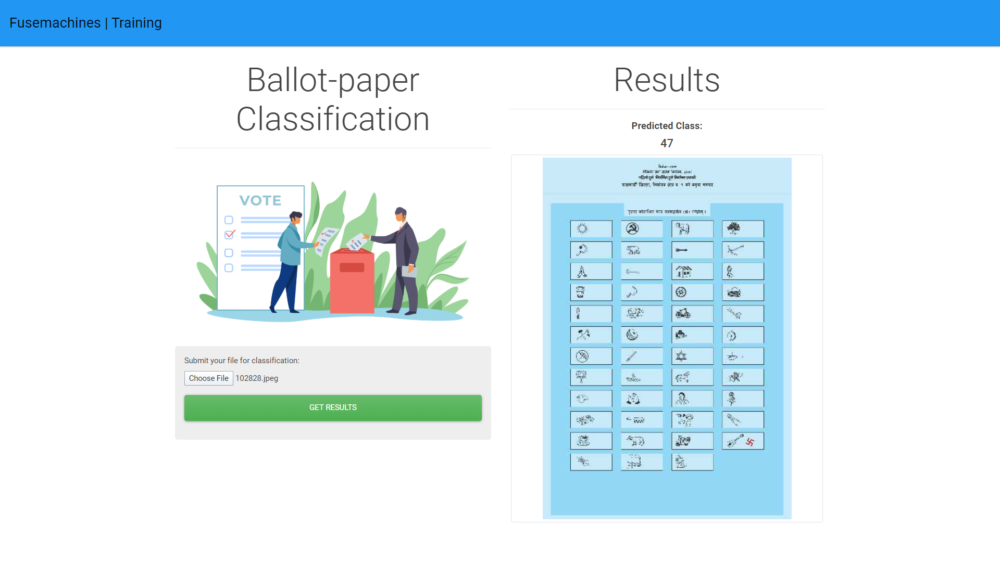
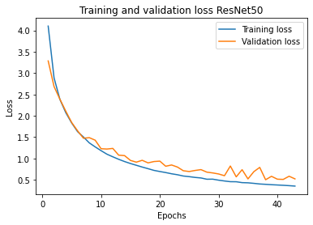

# Ballot Paper Classification - Computer Vision Project

## Demo

<p align="center">

</p>


# Project Structure

```
.
├── api_predict.py                       >>>> Prediction api
├── app.py
├── Data                                 >>>>Data folder
│   ├── Test                             >>>> Put testing data here
│   └── Train                            >>>> Put training data here
├── encoder.pkl
├── layout.png
├── main.py
├── model                               >>>>Location for model
├── model.h5                            >>>> Saved model
├── notebook                            >>>> Data analysis jupyter notebooks
├── output.jpeg
├── _predict.py                         >>>> File for making prediction
├── __pycache__
│   ├── api_predict.cpython-36.pyc
│   ├── api_predict.cpython-37.pyc
│   └── app.cpython-36.pyc
├── README.md                          >>>> README file
├── requirements.txt                   >>>> Requirement files
├── static                             >>>> Web related static files
│   └── 4585.jpg
└── templates                          >>>> Web related html and js files
    ├── index.html
    ├── js.html
    └── master.html
    
```

# Getting Started

## Install all requirements

`pip install -r requirements.txt`

## Model

The model is trained on ResNet50 architecture.
Model and encoder can be downloaded from the following link:

https://www.floydhub.com/cruzaan/datasets/ballot-model/1/

Store the `model`and `encoder` in artifacts directory.

<p align="center">

</p>

## Prepare the data for Evaluation

Prepare your dataset to proceed with the model. Your data folder structure should be on following format:

| ├── data <- Root data folder
│ │ ├── 0 <- Sub data folder with it's associated label
| │ │ ├── img1.jpeg <- Image file with same filename as on csv file

To structure data this way, while running `evaluate.py` make sure to change `process_data` param to `True`

## Evaluate data

The `evaluate.py` function will evaluate the provided data and returns the evaluation report as an output.

```
python evaluate.py
```

## Launch Flask app

To launch the flask app, type the following command
`python app.py`

The web app is launched at your local ip `127.0.0.1:8000`

